<p align="center">

<picture>
  <source media="(prefers-color-scheme: dark)" srcset="assets/dark.svg">
  <source media="(prefers-color-scheme: light)" srcset="assets/light.svg">
  
</picture>


# **Hi  My name is Jatin Kumar**

I am a student pursuing Bachelor of Technology in Computer Science And Engineering from Institute Of engineering and management currently in 4th year. I am a **Machine Learning & Data Science Enthusiast**

* 🌍  I'm based in India
* 🖥️  See my portfolio at [jkbytecrafter](https://jkbytecrafter.vercel.app/)
* ✉️  You can contact me at [jatinkumar15002@gmail.com](mailto:jatinkumar15002@gmail.com)
* 🚀  I'm currently working on [on AI & ML Projects](https://jkbytecrafter.vercel.app/)
* 🧠  I'm currently learning Deep Learning & LLMs
* 👥  I'm looking to collaborate on Open Source & AI
* 💬  Ask me about Fun fact: I craft bytes 🔨

---


```yaml
name:        Jatin Kumar
degree:      B.Tech CSE @ IEM, Kolkata
batch:       2023 - 2027
cgpa:        9.42 / 10
focus:
  - Machine Learning & Data Science
  - Deep Learning & Generative AI
  - Computer Vision & NLP
  - Full Stack Development
  - Research & Open Source
interests:   photography,sports
status:      Open to opportunities ✦
```

## 🌐 Socials:
[](https://www.instagram.com/itzzjatinn?igsh=MWdxNnJlcmdweDRvcw==)
[](https://facebook.com/jatinkumar105)
[](https://linkedin.com/in/jatin-kumar-2ba94a28a)
[](https://x.com/jkbytecrafter)
[](mailto:jatinkumar15002@gmail.com)
[](https://www.kaggle.com/jkbytecrafter)
[](https://huggingface.co/jkbytecrafter/spaces)
[](https://codolio.com/profile/jkbytecrafter)

# ⬡ Stack

<table>
<tr>
<th>Domain</th>
<th>Technologies</th>
</tr>

<tr>
<td><b>Languages</b></td>
<td>


</td>
</tr>

<tr>
<td><b>AI / ML</b></td>
<td>


</td>
</tr>

<tr>
<td><b>Web Dev</b></td>
<td>


</td>
</tr>

<tr>
<td><b>DevOps</b></td>
<td>


</td>
</tr>

<tr>
<td><b>Tools</b></td>
<td>


</td>
</tr>

</table>

# 📊 GitHub Stats:
<br/>
<br/>


# 🚀 Featured Projects

<div align="center">

<table>

<tr>

<td width="50%" valign="top">

## 🔗 SnapLink URL Shortener

Production-grade distributed URL shortener with analytics, QR generation, and high-speed redirection.

### ✨ Features
- Base62 encoded short URLs
- Real-time analytics & tracking
- JWT Authentication
- QR Code generation
- Bulk URL shortening
- Dockerized deployment

### 🛠️ Tech Stack
`FastAPI` `MongoDB` `Docker` `JWT` `Redis`

<br>

<a href="https://snaplink-api-o90i.onrender.com/">
  
</a>

<a href="https://github.com/jkbytecrafter/SnapLink">
  
</a>

</td>

<td width="50%" valign="top">

## 🤖 Autonomous Data Analyst

AI-powered end-to-end data science platform for EDA, AutoML, and AI-generated insights.

### ✨ Features
- Automated EDA dashboards
- AutoML pipeline using PyCaret
- AI business insights with Gemini
- Chat with data using LangChain
- PDF/HTML report generation

### 🛠️ Tech Stack
`FastAPI` `Streamlit` `PyCaret` `LangChain` `Gemini`

<br>

<a href="https://huggingface.co/spaces/jkbytecrafter/autonomous-data-analyst">
  
</a>

<a href="https://github.com/jkbytecrafter/Autonomous-Data-Analyst">
  
</a>

</td>

</tr>

<tr>

<td width="50%" valign="top">

## 📰 Hindi News Bias Detector

AI system for detecting bias in Hindi news articles using NLP and ML techniques.

### ✨ Features
- Hindi text bias classification
- Multiple ML model implementations
- FastAPI deployment
- Hugging Face Spaces support
- Docker-ready architecture

### 🛠️ Tech Stack
`FastAPI` `Scikit-learn` `Docker` `HF Spaces` `NLP`

<br>

<a href="https://huggingface.co/spaces/jkbytecrafter/NewsBiasDetector">
  
</a>

<a href="https://github.com/jkbytecrafter/NewsBiasDetection">
  
</a>

</td>

<td width="50%" valign="top">

## 🚁 Drone-to-Map AI System

AI-powered geospatial mapping system for drone footage analysis and urban tracking.

### ✨ Features
- Real-time object detection
- Multi-object tracking
- Geospatial visualization
- GPU optimized pipeline
- Interactive Folium mapping

### 🛠️ Tech Stack
`Python` `YOLOv8` `DeepSORT` `Folium` `Docker`

<br>


</td>

</tr>

<tr>

<td width="50%" valign="top">

## 🧠 Academic Research Agent

AI-powered multi-agent platform that automates academic research proposal generation using LangGraph and Gemini.

### ✨ Features
- 9 specialized AI research agents
- Full proposal generation pipeline
- Research gap identification
- RAG-powered methodology generation
- Funding alignment analysis
- Export proposals as Markdown

### 🛠️ Tech Stack
`LangGraph` `Gemini 2.5 Flash` `FAISS` `Flask` `React` `TailwindCSS`

<br>

<a href="https://academic-research-agent.vercel.app/">
  
</a>

<a href="https://github.com/jkbytecrafter/Academic-Research-Agent">
  
</a>

</td>

<td width="50%" valign="top">

## 💳 Alternative Credit Intelligence

AI-powered fintech platform for alternative credit scoring, fraud detection, and financial health intelligence.

### ✨ Features
- Alternative credit scoring (300–900)
- Fraud risk detection engine
- SHAP explainability dashboard
- Behavioral spender profiling
- Personalized financial recommendations
- AI-generated financial narratives

### 🛠️ Tech Stack
`FastAPI` `Next.js` `PostgreSQL` `XGBoost` `LightGBM` `SHAP`

<br>

<a href="https://alternative-credit-website.vercel.app/">
  
</a>

<a href="https://github.com/jkbytecrafter/Informal-Credit-Scoring">
  
</a>

</td>

</tr>

<tr>

<td width="50%" valign="top">

## 🎵 DeciCut Audio Editor

Privacy-first audio editing platform powered by FFmpeg with no login, database, or file history.

### ✨ Features
- Audio trimming & waveform editing
- Multi-format support (MP3, WAV, FLAC, AAC)
- Merge, split & extract clips
- Speed, pitch & volume controls
- Silence removal & audio normalization
- ZIP export & automatic file cleanup

### 🛠️ Tech Stack
`React` `TypeScript` `FastAPI` `FFmpeg` `WaveSurfer.js`

<br>
<a href="https://decicut.vercel.app/">
  
</a>

<a href="https://github.com/jkbytecrafter/DeciCut">
  
</a>

</td>

<td width="50%"></td>

</tr>

</table>

</div>

---


# 🏆 Achievements & Awards

🥇 **Best Session Paper Award**  
International Conference on English Learning and Teaching Skills (2024)

📈 **Academic Excellence**  
Secured **7th position** in CSE Department with **CGPA 9.47**

📜 **NPTEL Certifications**
- Fundamentals of Object Oriented Programming
- Operating System Fundamentals
- Python Programming
- Data Structures & Algorithms using Java
- Foundation of Cryptography

---

# 📄 Research Publications
## 🧠 Generating Images from Text Using GANs vs Transformers
Research paper comparing GAN and Transformer architectures for text-to-image generation presented at **IEMenTech 2025**
---

## 📰 Septic Sentences in Hindi News Media
Computational approach for detecting bias in Hindi news articles presented at **Language Resources and Evaluation 2026**
---

# 💼 Experience
## 🔬 IEM GenAI CoE Research Community
📅 Dec 2025
Worked on research initiatives in **Generative AI** and presented research work at **IEMENTECH 2024**


---

# 💻 Competitive Programming

<div align="center">

<table>
<tr>
<td align="center">


</td>

<td align="center">


</td>
</tr>
</table>

<br>

[](https://codeforces.com/profile/jatinkumar15002)
[](https://leetcode.com/jkbytecrafter)

</div>

### ⚡ Problem Solving Profiles

- 🟠 Solving DSA and algorithmic problems regularly on **LeetCode**
- 🔵 Practicing competitive programming and contests on **Codeforces**
- 🧠 Strong focus on:
  - Data Structures & Algorithms
  - Dynamic Programming
  - Graph Algorithms
  - Greedy Techniques
  - Problem Solving & Optimization

---

# 🎯 Current Focus

```python
class JatinKumar:

    def __init__(self):
        self.interests = [
            "Machine Learning",
            "Deep Learning",
            "Computer Vision",
            "Generative AI",
            "NLP",
            "Research"
        ]

    def current_goal(self):
        return "Building impactful AI systems 🚀"
```


## 🏆 GitHub Trophies


### 🔝 Top Contributed Repo


[](https://github.com/jkbytecrafter)


</p>
  
  
</p>
